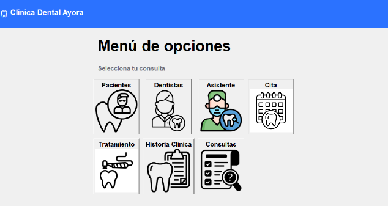
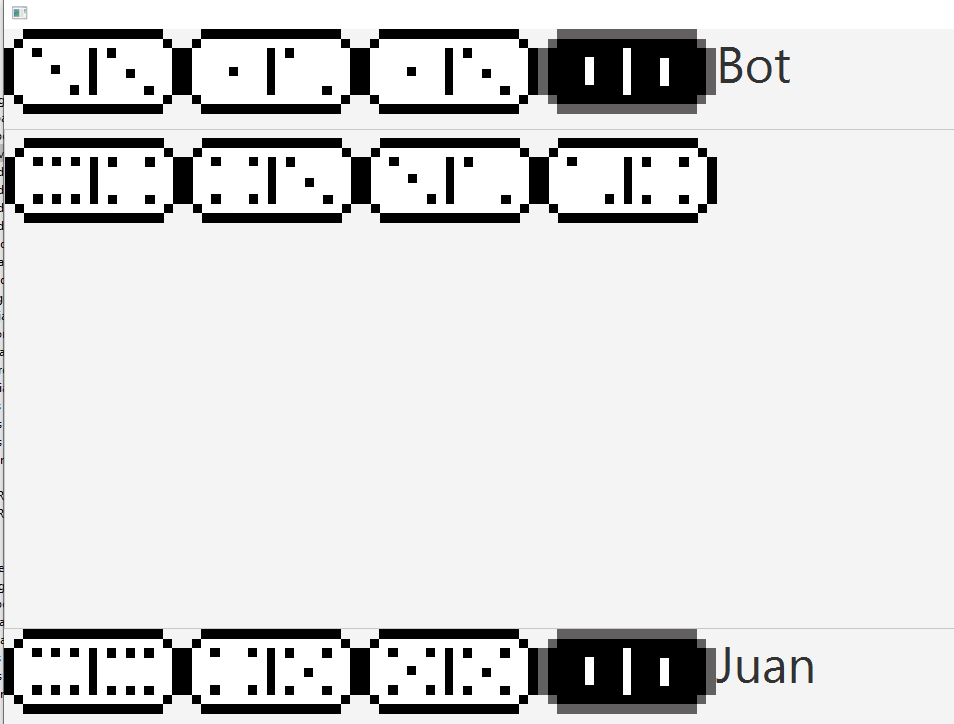

# Mi sitio personal

Este es mi sitio personal. Aquí puedes encontrar información sobre mí, mis proyectos y mis intereses.

---

## Contenido
- [Información personal](#información-personal)
- [Proyectos](#proyectos)
- [Tecnologías](#tecnologías)
- [Intereses](#intereses)

---

## Información personal
- **Nombre:** Juan Sebastián Pérez Zamora
- **Ocupación:** Estudiante de Ingeniería en Computación
- **Correo:** [jusepere@espol.edu.ec](mailto:jusepere@espol.edu.ec)

---

## Tecnologías
- **Bases de datos:** MySQL, PyMySQL  
  Usado en el proyecto de la clínica dental para gestionar la base de datos de pacientes, dentistas, citas y tratamientos.
- **Lenguajes de programación:** Java, Python
- **Frameworks y bibliotecas:**  
  - **JavaFX:** Utilizado para la interfaz gráfica del proyecto de dominó.  
  - **Tkinter:** Usado para la interfaz gráfica del proyecto de la clínica dental.
- **Estructuras y utilidades:**  
  - **ArrayList:** Implementado en el proyecto de dominó para gestionar las fichas.  
  - **HashMap:** Utilizado en el proyecto de contactos para organizar y buscar información de manera eficiente.  
  - **Comparator:** Aplicado en el proyecto de contactos para ordenar y comparar datos.  
  - **Serializable:** Usado en el proyecto de contactos para guardar y cargar datos de manera persistente.  
  - **Random:** Implementado en el proyecto de dominó para generar jugadas aleatorias.

---

## Proyectos

### 1. [Sistema de contactos usando Estructura de Datos](https://github.com/Juseperez/EstructurasProyecto)
- **Estado:** Terminado ✅
- **Integrantes:** [Juseperez](https://github.com/Juseperez), [Jorge Bravo](https://github.com/Reload2704), [kimi2123](https://github.com/kimi2123), [Ricardo24A](https://github.com/Ricardo24A)
- **Descripción:** Este proyecto implementa un sistema de contactos utilizando estructuras de datos avanzadas como listas enlazadas, iteradores y comparadores para optimizar la búsqueda y organización de contactos en Java.  
  

---

### 2. [Base de datos para una Clínica Dental usando MySQL](https://github.com/SKEIILAT/proyectoBD)
- **Estado:** Terminado ✅
- **Integrantes:** [Juseperez](https://github.com/Juseperez), [JairPalaguachi](https://github.com/JairPalaguachi), [Javier Alejandro](https://github.com/SKEIILAT), [LuisRoca09](https://github.com/LuisRoca09)
- **Descripción:** Proyecto que desarrolla una base de datos que permite agregar, editar, actualizar, eliminar y hacer consultas de pacientes, dentistas, citas y tratamientos en una clínica dental, utilizando MySQL para garantizar la integridad y eficiencia de los datos y la interface fue creada en Python.  

  

---

### 3. [Juego de fichas dominó, usando Programación Orientada a Objetos](https://github.com/Juseperez/ProyectoFicha)
- **Estado:** Terminado ✅
- **Integrantes:** [Juseperez](https://github.com/Juseperez), [Sialmeid2003](https://github.com/Sialmeid2003)
- **Descripción:** Un juego de dominó desarrollado en Java, aplicando principios de programación orientada a objetos para colocar las fichas, las reglas del juego, la interface usando JavaFX y las jugadas que toma el bot jugador.  

  

---

## Intereses
- Aprender nuevas tecnologías
- Jugar con la IA para tener nuevos conocimientos
