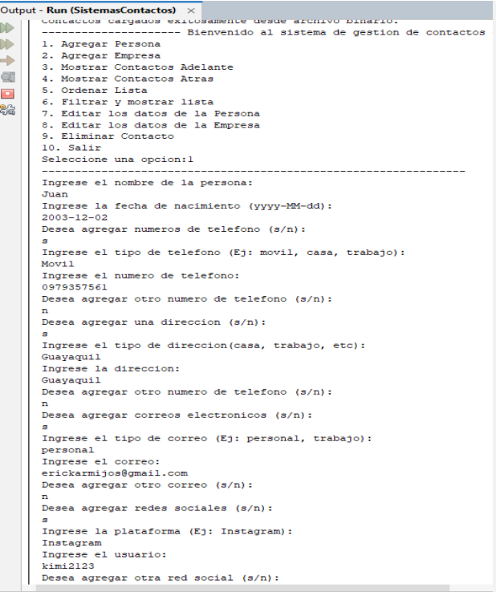

# Mi sitio personal

Este es mi sitio personal. Aquí puedes encontrar información sobre mí, mis proyectos y mis intereses.

---

## Contenido
- [Información personal](#información-personal)
- [Proyectos](#proyectos)
- [Tecnologías](#tecnologías)
- [Intereses](#intereses)

---

## Información personal
- **Nombre:** Juan Sebastián Pérez Zamora
- **Ocupación:** Estudiante de Ingeniería en Computación
- **Correo:** [jusepere@espol.edu.ec](mailto:jusepere@espol.edu.ec)

---

## Tecnologías
- **Bases de datos:** MySQL
- **Lenguajes de programación:** Java, Python

---

## Proyectos

### 1. [Sistema de contactos usando Estructura de Datos](https://github.com/Juseperez/EstructurasProyecto)
- **Estado:** Terminado ✅
- **Descripción:** Este proyecto implementa un sistema de contactos utilizando estructuras de datos avanzadas como listas enlazadas y árboles binarios para optimizar la búsqueda y organización de contactos.
- **Imagen:**
  

---

### 2. [Base de datos para una Clínica Dental usando MySQL](https://github.com/SKEIILAT/proyectoBD)
- **Estado:** Terminado ✅
- **Descripción:** Proyecto que desarrolla una base de datos completa para la gestión de pacientes, citas y tratamientos en una clínica dental, utilizando MySQL para garantizar la integridad y eficiencia de los datos.
  

---

### 3. [Juego de fichas dominó, usando Programación Orientada a Objetos](https://github.com/Juseperez/ProyectoFicha)
- **Estado:** Terminado ✅
- **Descripción:** Un juego de dominó desarrollado en Java, aplicando principios de programación orientada a objetos para modelar las fichas, las reglas del juego y la interacción entre los jugadores.
- **Imagen:**
  

---

## Intereses
- Crear un sitio web
- Crear una aplicación para móviles
- Diseñar y crear un juego
